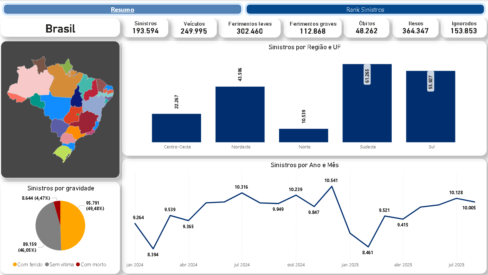

# Análise de Sinistros em Rodovias Federais do Brasil


## 📋 Sobre o Projeto

Este projeto foi desenvolvido para a disciplina **SDB2 (Sistemas de Banco de Dados 2)** da **Universidade de Brasília (UnB)**, com o objetivo de realizar uma análise exploratória e estatística dos dados de sinistralidade nas rodovias federais brasileiras, utilizando a **arquitetura Medallion** para processamento e análise de dados.

Para a análise, foram utilizados dados oficiais de sinistros rodoviários disponibilizados pela [**Polícia Rodoviária Federal (PRF)**](https://www.gov.br/prf/pt-br/acesso-a-informacao/dados-abertos/dados-abertos-da-prf), abrangendo os anos de 2024 e 2025, totalizando aproximadamente 980 mil registros. O projeto envolve desde o tratamento inicial dos dados brutos até a criação de um data warehouse em modelo star schema, além da visualização dos resultados por meio de dashboards interativos no Power BI.

É possível visualizar as etapas do projeto, desde a ingestão dos dados brutos (Bronze Layer), passando pela limpeza e transformação (Silver Layer), até a modelagem dimensional e análise final (Gold Layer).

Como resultado, temos:

- [Mapa interativo dos sinistros do Centro-Oeste](https://yagoas.github.io/SinistrosPRF/assets/sinistros_centro_oeste.html) (O mapa completo está disponível em: /assets/mapa_sinistros.html)
- Dashboard no Power BI: [Dashboard Power BI](https://app.powerbi.com/view?r=eyJrIjoiZGQzYWU0MGUtNzM3Zi00Y2ZhLWJmMzUtODQ4MzU1YzYyYzU0IiwidCI6ImVjMzU5YmExLTYzMGItNGQyYi1iODMzLWM4ZTZkNDhmODA1OSJ9) ou no [repositório](assets/dashboard_powerbi)



## 🏗️ Arquitetura do Projeto

O projeto segue a **arquitetura Medallion** com três camadas principais:

```
SinistrosPRF/
├── data_layer/
│   ├── raw/                                      # Camada Bronze - Dados Brutos
│   │   ├── analytics.ipynb                       # Análise exploratória dos dados brutos
│   │   ├── acidentes2024_todas_causas_tipos.csv  # Dados de 2024
│   │   ├── acidentes2025_todas_causas_tipos.csv  # Dados de 2025
│   │   └── dicionario_de_dados.md                # Dicionário de dados da camada raw
│   │
│   ├── silver/                                   # Camada Silver - Dados Tratados
│   │   ├── analytics.ipynb                       # Análises da camada silver
│   │   ├── ddl.sql                               # DDL do banco de dados Silver
│   │   └── mer_der_dld.md                        # Modelagem Silver (MER/DER/DLD)
│   │
│   └── gold/                                     # Camada Gold - Data Warehouse
│       ├── consultas.sql                         # Consultas analíticas
│       ├── ddl.sql                               # DDL do Data Warehouse (Star Schema)
│       ├── mapa.ipynb                            # Visualizações geográficas
│       └── mer_der_dld.md                        # Modelagem Gold (Star Schema)
│       ├── mer_der_dld.md                        # Modelagem Gold (MER/DER/DLD)
│       ├── mnemonico.pdf                         # Mnemônicos do modelo dimensional
│       └── mapa.ipynb                            # Visualizações e mapas interativos
│
├── transformer/
│   ├── etl_raw_to_silver.ipynb                   # ETL: Raw → Silver
│   └── etl_silver_to_gold.ipynb                  # ETL: Silver → Gold
│
├── assets/                                       # Arquivos estáticos (mapas HTML, etc.)
├── docker-compose.yml                            # Configuração Docker (PostgreSQL)
├── Dockerfile                                    # Imagem Docker para o ambiente
├── requirements.txt                              # Dependências Python
└── README.md
```

### 🥉 **Raw Layer (Dados Brutos)**

- Dados originais da PRF sem processamento
- 2 arquivos CSV com ~980k registros (2024-2025)
- Dicionário de dados e análise exploratória inicial

### 🥈 **Silver Layer (Dados Tratados)**

- Dados limpos e normalizados
- **PostgreSQL containerizado** como banco de dados
- Modelagem relacional documentada (MER, DER, DLD)
- ETL automatizado via notebooks Jupyter

### 🥇 **Gold Layer (Data Warehouse)**

- **Modelo Star Schema** para análise dimensional
- Tabelas fato e dimensões otimizadas
- Consultas analíticas pré-definidas
- Visualizações e dashboards

## 🎯 Objetivos

- **Análise Exploratória**: Compreender os padrões de sinistros nas rodovias federais
- **Tratamento de Dados**: Implementar pipeline ETL automatizado
- **Modelagem Dimensional**: Criar data warehouse em star schema
- **Visualização**: Dashboards interativos no Power BI
- **Insights**: Extrair informações relevantes para políticas públicas de segurança viária

## 📊 Dados Utilizados

O projeto utiliza os dados oficiais de **sinistros rodoviários** disponibilizados pela **Polícia Rodoviária Federal (PRF)**, contendo:

- **Período**: 2024-2025
- **Registros**: Aproximadamente 980k registros e 120k sinistros
- **Variáveis**: 37 colunas incluindo localização, horário, tipo de acidente, vítimas, condições meteorológicas, veículos envolvidos, etc.
- **Referência**: <a ref="https://www.gov.br/prf/pt-br/acesso-a-informacao/dados-abertos/dados-abertos-da-prf"><b>Dados Abertos da PRF (Agrupados por pessoa - Todas as causas e tipos de sinistros)</b></a>. Acessado em: 13/09/2025

### 📁 Estrutura do Projeto

Veja a estrutura completa na seção [🏗️ Arquitetura do Projeto](#-arquitetura-do-projeto) acima.

## 🛠️ Tecnologias Utilizadas

### **Linguagem & Ambiente**

- **Python 3.11+** - Linguagem principal
- **Jupyter Notebook** - Ambiente de desenvolvimento interativo e execução de ETLs
- **Visual Studio Code** - IDE principal com extensões para Jupyter

### **Infraestrutura**

- **PostgreSQL 15** - Banco de dados relacional (schemas Silver e Gold)
- **Docker & Docker Compose** - Containerização do banco de dados
- **SQLAlchemy 2.0** - ORM e engine para PostgreSQL
- **Psycopg2** - Driver PostgreSQL para Python

### **Pipeline ETL**

- **Pandas 2.3+** - Manipulação e transformação de dados
- **NumPy** - Operações numéricas e tratamento de arrays
- **Python-dotenv** - Gerenciamento de variáveis de ambiente

### **Modelagem de Dados**

- **Camada Raw**: Arquivos CSV (~980k registros)
- **Camada Silver**: PostgreSQL - Dados normalizados e limpos
- **Camada Gold**: PostgreSQL - Star Schema (6 dimensões + 1 fato)

### **Visualização & Análise**

- **Matplotlib & Seaborn** - Gráficos e visualizações estatísticas
- **Folium** - Mapas interativos georreferenciados
- **Power BI** - Dashboards e relatórios executivos (em desenvolvimento)
- **NumPy** - Operações numéricas
- **Matplotlib & Seaborn** - Visualização estatística
- **TQDM** - Barra de progresso para scripts
- **Folium & Branca** - Mapas interativos

### **Modelagem de Dados**

```python
├── PostgreSQL      # Banco relacional (Silver)
├── Star Schema     # Modelagem dimensional (Gold)
├── MER/DER/DLD     # Documentação de modelagem
└── DDL Scripts     # Scripts de criação
```

## Como Executar

### Pré-requisitos

- Docker e Docker Compose instalados
- Python 3.11+ instalado
- Jupyter Notebook/Lab ou VS Code com extensão Python

### Passos Rápidos

1. **Clone o repositório**

```bash
git clone https://github.com/Yagoas/SinistrosPRF.git
cd SinistrosPRF
```

2. **Suba o banco de dados PostgreSQL**

```bash
docker-compose up -d --build
```

Isso irá:

- Construir a imagem Docker customizada (PostgreSQL + init_db.sql)
- Subir o container na porta 5432
- Executar automaticamente o init_db.sql
- Criar schemas `dl` e `dw` com todas as tabelas

3. **Instale as dependências Python**

```bash
pip install -r requirements.txt
```

4. **Execute os notebooks ETL na ordem**

- `transformer/etl_raw_to_silver.ipynb` - Carrega CSVs e popula schema Silver (~980k registros)
- `transformer/etl_silver_to_gold.ipynb` - Cria Star Schema na Gold Layer (6 dims + 1 fato)

5. **Explore os dados**

- `data_layer/raw/analytics.ipynb` - Análise exploratória dos dados brutos
- `data_layer/silver/analytics.ipynb` - Análise dos dados normalizados
- `data_layer/gold/mapa.ipynb` - Visualizações geográficas interativas
- `data_layer/gold/consultas.sql` - Queries analíticas prontas

## 📊 Fluxo de Dados

```
Dados PRF (CSV 2024 + 2025)
      ↓
┌─────────────────────────┐
│      Raw Layer          │ ← Dados brutos (~980k registros)
│  analytics.ipynb        │
└─────────────────────────┘
      ↓ ETL (etl_raw_to_silver.ipynb)
┌─────────────────────────┐
│      Silver Layer       │ ← PostgreSQL - Dados limpos e normalizados
│  analytics.ipynb        │    (tb_sinistros_silver)
└─────────────────────────┘
      ↓ ETL (etl_silver_to_gold.ipynb)
┌─────────────────────────┐
│      Gold Layer         │ ← PostgreSQL - Star Schema
│  mapa.ipynb             │    (6 dimensões + fato_sinistro)
│  visualizações          │
└─────────────────────────┘
      ↓
  Power BI / Mapas
```

## 👥 Equipe

**Disciplina**: SDB2 - Sistemas de Banco de Dados 2  
**Instituição**: Universidade de Brasília (UnB)  
**Período**: 2º Semestre de 2025  
**Integrantes**:

<div align="center">
<table>
  <tr>
    <td align="center">
      <a href="https://github.com/xGabrielCv">
        
        <br /><sub><b>Jésus Gabriel Carvalho Ventura (21/1062956)</b></sub>
      </a>
    </td>
    <td align="center">
      <a href="https://github.com/JoelSRangel">
        
        <br /><sub><b>Joel Soares Rangel (21/1039546)</b></sub>
      </a>
    </td>
    <td align="center">
      <a href="https://github.com/valdersonjr">
        
        <br /><sub><b>Valderson Pontes da Silva Junior (19/0020521)</b></sub>
      </a>
    </td>
    <td align="center">
      <a href="https://github.com/Yagoas">
        
        <br /><sub><b>Yago Amin Santos (19/0101091)</b></sub>
      </a>
    </td>
  </tr>
</table>
</div>

## 📝 Licença

Este projeto foi desenvolvido para fins acadêmicos na UnB e sua replicação deve ser devidamente referenciada.
