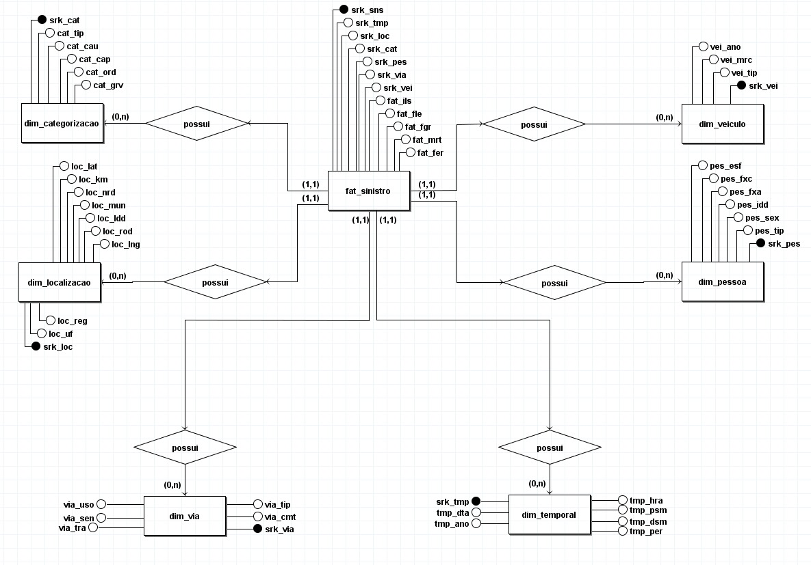
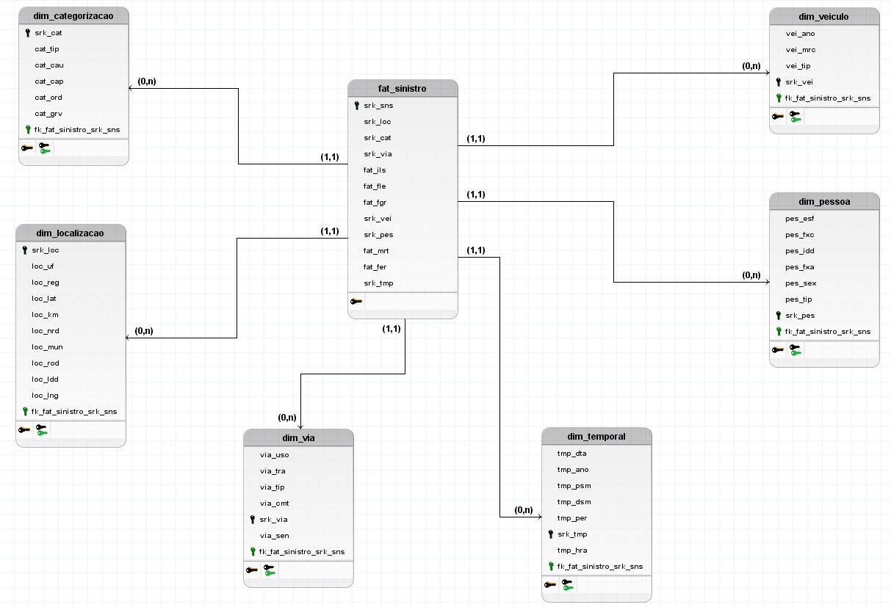

# Modelo Entidade-Relacionamento
---

## ENTIDADES

- **FAT_SINISTRO**
- **DIM_CATEGORIZACAO**
- **DIM_LOCALIZACAO**
- **DIM_VIA**
- **DIM_TEMPORAL**
- **DIM_PESSOA**
- **DIM_VEICULO**

---

## ATRIBUTOS

### FAT_SINISTRO

- srk_sns
- srk_tmp
- srk_loc
- srk_cat
- srk_via
- srk_pes
- srk_vei
- fat_ils
- fat_fle
- fat_fgr
- fat_fer
- fat_mrt

### DIM_CATEGORIZACAO

- srk_cat
- cat_cau
- cat_ord
- cat_grv
- cat_tip

### DIM_LOCALIZACAO

- srk_loc
- loc_uf
- loc_ldd
- loc_reg
- loc_mun
- loc_rod
- loc_nrd
- loc_km
- loc_lng
- loc_lat

### DIM_VIA

- srk_via
- via_cmt
- via_tip
- via_tra
- via_uso
- via_sen

### DIM_TEMPORAL

- srk_tmp
- tmp_dta
- tmp_ano
- tmp_hra
- tmp_per
- tmp_dsm
- tmp_psm

### DIM_PESSOA

- srk_pes
- pes_tip
- pes_sex
- pes_idd
- pes_fxa
- pes_fxc
- pes_esf

### DIM_VEICULO

- srk_vei
- vei_tip
- vei_ano
- vei_mrc

---

## RELACIONAMENTOS

### FAT_SINISTRO – possui – DIM_VEICULO

- **Cardinalidade**: 1:N  
- Um `FAT_SINISTRO` pode possuir múltiplos `DIM_VEICULO`, mas um `DIM_VEICULO` pode estar em posse de apenas um `FAT_SINISTRO`.

### FAT_SINISTRO – possui – DIM_PESSOA

- **Cardinalidade**: 1:N  
- Um `FAT_SINISTRO` pode possuir múltiplos `DIM_PESSOA`, mas um `DIM_PESSOA` pode estar em posse de apenas um `FAT_SINISTRO`.

### FAT_SINISTRO – possui – DIM_TEMPORAL

- **Cardinalidade**: 1:N  
- Um `FAT_SINISTRO` pode possuir múltiplos `DIM_TEMPORAL`, mas um `DIM_TEMPORAL` pode estar em posse de apenas um `FAT_SINISTRO`.

### FAT_SINISTRO – possui – DIM_VIA

- **Cardinalidade**: 1:N  
- Um `FAT_SINISTRO` pode possuir múltiplos `DIM_VIA`, mas um `DIM_VIA` pode estar em posse de apenas um `FAT_SINISTRO`.

### FAT_SINISTRO – possui – DIM_LOCALIZACAO

- **Cardinalidade**: 1:N  
- Um `FAT_SINISTRO` pode possuir múltiplos `DIM_LOCALIZACAO`, mas um `DIM_LOCALIZACAO` pode estar em posse de apenas um `FAT_SINISTRO`.

### FAT_SINISTRO – possui – DIM_CATEGORIZACAO

- **Cardinalidade**: 1:N  
- Um `FAT_SINISTRO` pode possuir múltiplos `DIM_CATEGORIZACAO`, mas um `DIM_CATEGORIZACAO` pode estar em posse de apenas um `FAT_SINISTRO`.

# DIAGRAMA ENTIDADE-RELACIONAMENTO (DER)

# Diagrama Lógico de Dados (DLD)

