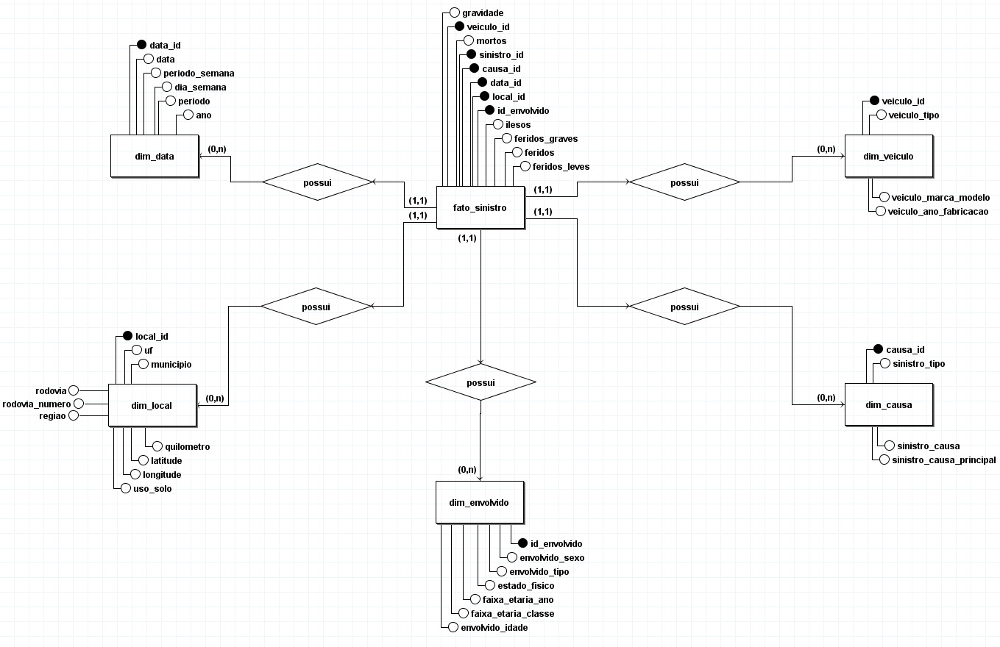
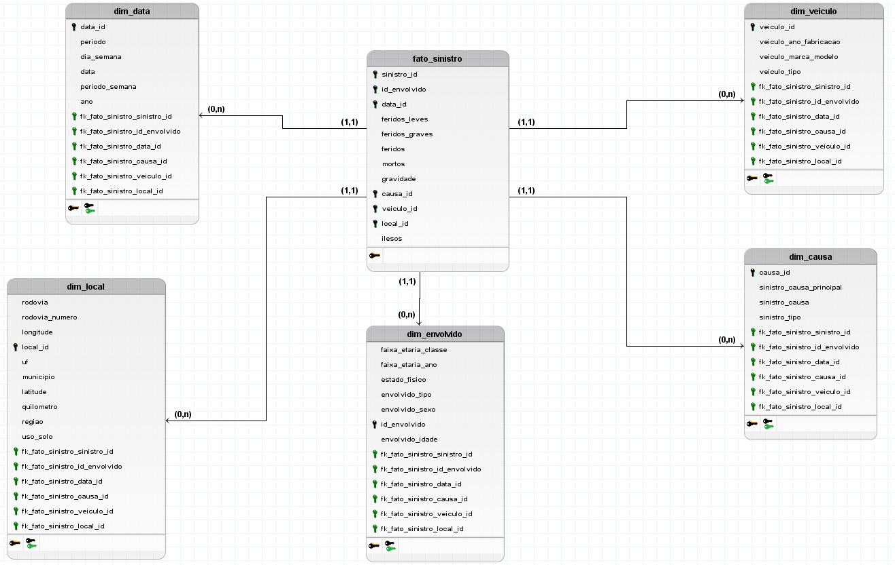

# Modelo Entidade-Relacionamento
---

## ENTIDADES

- **FATO_SINISTRO**
- **DIM_VEICULO**
- **DIM_DATA**
- **DIM_LOCAL**
- **DIM_CAUSA**
- **DIM_ENVOLVIDO**

---

## ATRIBUTOS

### FATO_SINISTRO

- veiculo_id
- sinistro_id
- causa_id
- data_id
- local_id
- envolvido_id
- gravidade
- mortos
- ilesos
- feridos_graves
- feridos
- feridos_leves

### DIM_VEICULO

- veiculo_id
- veiculo_tipo
- veiculo_marca_modelo
- veiculo_ano_fabricacao

### DIM_DATA

- data_id
- data
- periodo_semana
- dia_semana
- periodo
- ano

### DIM_LOCAL

- local_id
- uf
- municipio
- rodovia
- rodovia_numero
- regiao
- quilometro
- latitude
- longitude
- uso_solo

### DIM_CAUSA

- causa_id
- sinistro_tipo
- sinistro_causa
- sinistro_causa_principal

### DIM_ENVOLVIDO

- id_envolvido
- envolvido_sexo
- envolvido_tipo
- estado_fisico
- faixa_etaria_ano
- faixa_etaria_classe
- envolvido_idade

---

## RELACIONAMENTOS

### FATO_SINISTRO – possui – DIM_VEICULO

- **Cardinalidade**: 1:N
- Um `FATO_SINISTRO` pode possuir múltiplos `DIM_VEICULO`, mas um `DIM_VEICULO` pode estar em posse de apenas um `FATO_SINISTRO`.

### FATO_SINISTRO – possui – DIM_DATA

- **Cardinalidade**: 1:N
- Um `FATO_SINISTRO` pode possuir múltiplos `DIM_DATA`, mas um `DIM_DATA` pode estar em posse de apenas um `FATO_SINISTRO`.

### FATO_SINISTRO – possui – DIM_LOCAL

- **Cardinalidade**: 1:N
- Um `FATO_SINISTRO` pode possuir múltiplos `DIM_LOCAL`, mas um `DIM_LOCAL` pode estar em posse de apenas um `FATO_SINISTRO`.

### FATO_SINISTRO – possui – DIM_CAUSA

- **Cardinalidade**: 1:N
- Um `FATO_SINISTRO` pode possuir múltiplos `DIM_CAUSA`, mas um `DIM_CAUSA` pode estar em posse de apenas um `FATO_SINISTRO`.

### FATO_SINISTRO – possui – DIM_ENVOLVIDO

- **Cardinalidade**: 1:N
- Um `FATO_SINISTRO` pode possuir múltiplos `DIM_ENVOLVIDO`, mas um `DIM_ENVOLVIDO` pode estar em posse de apenas um `FATO_SINISTRO`.

# DIAGRAMA ENTIDADE-RELACIONAMENTO (DER)

# Diagrama Lógico de Dados (DLD)

