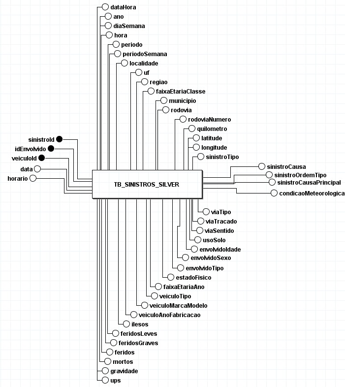

## DIAGRAMA ENTIDADE-RELACIONAMENTO (DER)

O Diagrama Entidade-Relacionamento (DER) é uma representação gráfica do modelo de dados em nível conceitual. Foca em entidades e seus atributos, sem detalhar aspectos de implementação física (tipos de dados, índices, PK/FK físicas).

### DER conceitual do projeto (Camada Silver)

- **Entidade**: TB_SINISTROS_SILVER
- **Identificadores de negócio (conceituais)**: `sinistroId`, `idEnvolvido`, `veiculoId`
- **Relacionamentos**: Não representados nesta camada; a entidade consolida informações de sinistro, pessoa, veículo, tempo e localização para análise.

Observação: A camada Silver adota o estilo lakehouse com uma única entidade agregadora. Eventuais normalizações (ex.: separar Pessoa/Veículo/Tempo/Local) pertencem a um modelo lógico/físico fora do escopo deste DER conceitual.

