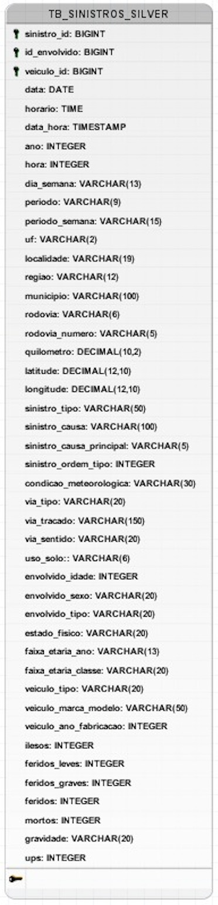

## DIAGRAMA LÓGICO DE DADOS (DLD)

O Diagrama Lógico de Dados descreve a estrutura lógica do banco: tabelas, colunas, tipos, chaves e índices. Ele detalha como o modelo conceitual é representado logicamente, sem se prender a particularidades de implementação física específicas do SGBD.

### DLD do projeto (Camada Silver)

Observação: o DLD reflete a estrutura lógica consumida na camada Silver (tabela única). Normalizações adicionais podem ser aplicadas em modelos lógico/dimensionais específicos para BI, quando necessário.

